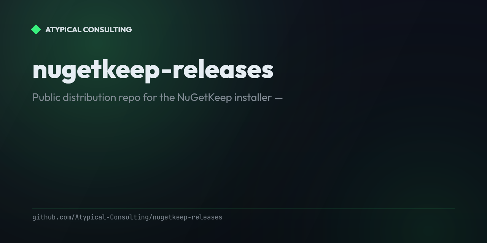

# nugetkeep-releases

<!-- portfolio-badges:start -->
<!-- Identity -->
[](https://github.com/Atypical-Consulting/nugetkeep-releases)

[](https://github.com/Atypical-Consulting/nugetkeep-releases/stargazers)
[](https://github.com/Atypical-Consulting/nugetkeep-releases/network/members)

<!-- Activity -->
[](https://github.com/Atypical-Consulting/nugetkeep-releases/issues)
[](https://github.com/Atypical-Consulting/nugetkeep-releases/pulls)
[](https://github.com/Atypical-Consulting/nugetkeep-releases/commits)
<!-- portfolio-badges:end -->

<!-- portfolio-toc:start -->

## Table of Contents

- [Features](#features)
- [Usage](#usage)
- [Contributing](#contributing)
- [License](#license)

<!-- portfolio-toc:end -->


Public distribution repo for the [NuGetKeep](https://nugetkeep.com) installer —
these binaries back `curl -fsSL https://nugetkeep.com/install | bash`.

Releases are published automatically by the (private) product repo's
`installer-release.yml`. No source code lives here.

## Features

This repo only holds release artifacts, but the install flow it serves does real work:

- **Prebuilt binaries per release** — self-contained `nugetkeep-install` builds for Linux (x64/arm64) and macOS (x64/arm64), attached to each GitHub Release.
- **Checksum-verified installs** — every download is checked against a published `checksums.txt` (SHA-256) by the install shim before it runs.
- **Version pinning** — a specific release can be pinned instead of always installing latest.
- **Platform fallbacks documented** — Windows via WSL2, Alpine/musl via the Docker image, since there's no native binary for either.
- **Fully automated publishing** — releases are cut by the private product repo's CI; nothing here is hand-pushed.

## Usage

Install the latest version:

```bash
curl -fsSL https://nugetkeep.com/install | bash
```

Pin a specific version:

```bash
curl -fsSL https://nugetkeep.com/install | NUGETKEEP_INSTALL_VERSION=0.5.0 bash
```

On Windows, run the installer under WSL2; on Alpine/musl, use the Docker image instead — the shim doesn't ship a musl binary.

---

<!-- portfolio-sections:start -->

## Contributing

Contributions are welcome. Open an issue first to discuss any significant change.

1. Fork the repository and create your branch (`git checkout -b feat/my-feature`)
2. Commit your changes (`git commit -m 'feat: ...'`)
3. Push the branch and open a Pull Request

## License

No license has been declared for this repository yet. Until one is added, default copyright applies — see [choosealicense.com](https://choosealicense.com/) if you intend to open it up.

<!-- portfolio-sections:end -->
