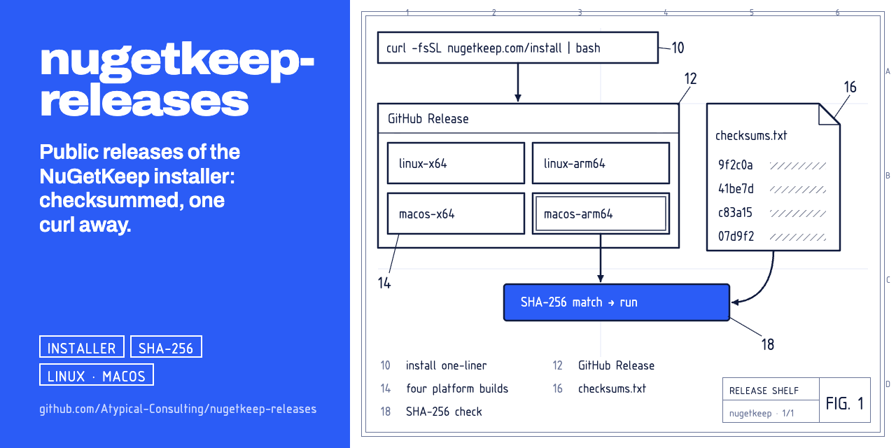

# nugetkeep-releases

<!-- portfolio-badges:start -->
<!-- Identity -->
[](https://github.com/Atypical-Consulting/nugetkeep-releases)

[](https://github.com/Atypical-Consulting/nugetkeep-releases/stargazers)
[](https://github.com/Atypical-Consulting/nugetkeep-releases/network/members)

<!-- Activity -->
[](https://github.com/Atypical-Consulting/nugetkeep-releases/issues)
[](https://github.com/Atypical-Consulting/nugetkeep-releases/pulls)
[](https://github.com/Atypical-Consulting/nugetkeep-releases/commits)
<!-- portfolio-badges:end -->

<!-- portfolio-toc:start -->

## Table of Contents

- [Install](#install)
- [Docker image](#docker-image)
- [Editions and pricing](#editions-and-pricing)
- [Links](#links)
- [About this repository](#about-this-repository)
- [Contributing](#contributing)
- [License](#license)

<!-- portfolio-toc:end -->

NuGetKeep is a self-hosted NuGet v3 server that gates every uploaded package through a
supply-chain quarantine (OSV vulnerability scan), with OIDC/SSO + RBAC, keyless trusted
publishing, multiple isolated feeds, a symbol server, and read-only MCP tools — shipped as a
single Docker image that runs anywhere, including air-gapped.

## Install

```bash
curl -fsSL https://nugetkeep.com/install | bash
```

Pin a specific version:

```bash
curl -fsSL https://nugetkeep.com/install | NUGETKEEP_INSTALL_VERSION=0.5.0 bash
```

Every download is checked against a published `checksums.txt` (SHA-256) by the install shim
before it runs. There's no native Windows binary — the installer's bootstrap tells Windows users
to run it under WSL2; on Alpine/musl, use the Docker image below instead.

## Docker image

```bash
docker pull ghcr.io/atypical-consulting/nugetkeep
```

Public on the GitHub Container Registry — no login required to pull it.

## Editions and pricing

| Edition | Price |
| --- | --- |
| Community | Free |
| Team | 1 090 € HT/an |
| Enterprise | 2 990 € HT/an |

Full feature breakdown: [nugetkeep.com/pricing](https://nugetkeep.com/pricing/).

## Links

- Website: <https://nugetkeep.com>
- Docs: <https://nugetkeep.com/docs/>
- Pricing: <https://nugetkeep.com/pricing/>

## About this repository

Releases are published automatically by the (private) product repo's `installer-release.yml`.
No source code lives here — this repo only holds release artifacts: prebuilt `nugetkeep-install`
binaries for Linux (x64/arm64) and macOS (x64/arm64), attached to each GitHub Release alongside
their checksums.

<!-- portfolio-sections:start -->

## Contributing

Contributions are welcome. Open an issue first to discuss any significant change.

1. Fork the repository and create your branch (`git checkout -b feat/my-feature`)
2. Commit your changes (`git commit -m 'feat: ...'`)
3. Push the branch and open a Pull Request

## License

No license has been declared for this repository yet. Until one is added, default copyright applies — see [choosealicense.com](https://choosealicense.com/) if you intend to open it up.

<!-- portfolio-sections:end -->
